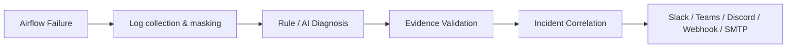
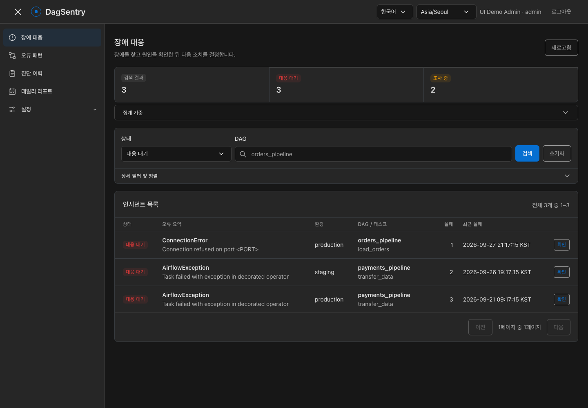
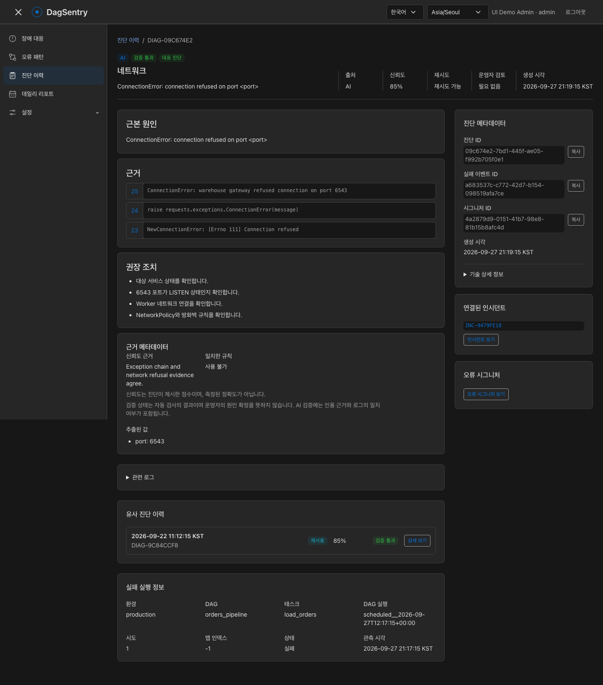

# DagSentry

**Airflow 3 Failure Intelligence & Incident Management**

Evidence-validated Airflow failure diagnosis. DagSentry collects and masks failed Task logs,
produces rule-based or AI diagnoses, and connects recurring failures to Incidents your team can
investigate and resolve. AI evidence is checked against the exact sanitized log excerpt before a
diagnosis can become effective; validation is a consistency check, not proof of the root cause.



- **Trace the evidence:** inspect cited log lines, validation results, and recommended actions.
- **Track recurring failures:** group Error Signatures, review Incident history, and record operator decisions.
- **Run a small stack:** a Python API serves the Tabler UI with native ES modules; no Node runtime or frontend build is required.

[Install DagSentry](docs/v0.1-installation.md) · [Operator manual](docs/user-manual.md) · [한국어 문서](docs/README.ko.md)

**Incident response** — find active failures and review their latest activity.



**Diagnosis evidence** — inspect the cause alongside cited, sanitized log lines and recommended actions.



Screenshots use seeded demo data in the Korean UI; English is also available. They do not represent
live Airflow failures or a live model evaluation. See [screenshot reproduction](docs/frontend-architecture.md#verification).

## Documentation

### Getting started and operations

- [Installation](docs/v0.1-installation.md)
- [Operations](docs/operations.md)
- [Production deployment](docs/production-deployment.md)
- [Backup and recovery](docs/backup-recovery.md)
- [Version compatibility](docs/version-compatibility.md)
- [Production security checklist](docs/security-checklist.md)
- [한국어 문서](docs/README.ko.md)
- [Development history (T00–T16; historical verification records)](docs/development-history.ko.md)

### Core and Airflow

- [Core lifecycle contracts](docs/core-lifecycle-contracts.md)
- [Security boundaries](docs/security-boundaries.md)
- [Airflow integration](docs/airflow-integration.md)
- [Task Try log collection](docs/task-log-collection.md)
- [Log processing and masking](docs/log-processing.md)
- [Rule Diagnosis](docs/rule-diagnosis.md)
- [Error Signatures](docs/error-signature.md)
- [Diagnosis persistence and reuse](docs/diagnosis-persistence.md)
- [AI Diagnosis](docs/ai-diagnosis.md)
- [Evidence Validation](docs/evidence-validation.md)
- [Incident management](docs/incident-management.md)
- [Missed Failure reconciliation](docs/reconciler.md)
- [Worker recovery](docs/worker-recovery.md)
- [Incident recovery checks](docs/recovery-checker.md)
- [Metrics and alerts](docs/metrics.md)
- [Daily Statistics](docs/daily-statistics.md)
- [Daily Reports](docs/daily-report.md)

### Providers and notifications

- [Provider comparison](docs/provider-comparison.md)
- [LLM Provider contract](docs/llm-provider-contract.md)
- [Azure OpenAI](docs/azure-openai-provider.md)
- [Anthropic](docs/anthropic-provider.md)
- [AWS Bedrock](docs/bedrock-provider.md)
- [Ollama](docs/ollama-provider.md)
- [Notification Provider contract](docs/notification-provider-contract.md)
- [Webhook](docs/notification.md)
- [Slack](docs/slack-provider.md)
- [Microsoft Teams](docs/teams-provider.md)
- [Discord](docs/discord-provider.md)
- [SMTP](docs/smtp-provider.md)

### Web UI and administration

- [Web UI](docs/web-ui.md)
- [Operator manual](docs/user-manual.md)
- [Managed Connections](docs/managed-connections.md)

## Requirements

- Python 3.11 or 3.12
- Airflow >=3.1.8,<4 for the optional collector integration (3.1.8 and 3.3.1 checked)
- [uv](https://docs.astral.sh/uv/)

## Development

Install the project and development dependencies:

```shell
uv sync
```

Start PostgreSQL and apply the database Migration:

```shell
cp .env.example .env
docker compose up -d postgres
uv run alembic upgrade head
```

`compose.yaml` reads PostgreSQL settings from `.env`; the committed values in `.env.example` are
examples only. For the isolated local demo database, use
`docker compose -f compose.yaml -f compose.demo.yaml up -d postgres`.

Replace `DAGSENTRY_INGEST_API_TOKEN` in `.env` before sending Failure Events.

Run the API:

```shell
uv run dagsentry-api
```

The process exposes:

- `GET /health/live`: process liveness
- `GET /health/ready`: readiness for the currently implemented dependencies
- `GET /metrics`: durable Prometheus operational metrics

Run the checks:

```shell
uv run ruff check .
uv run ruff format --check .
uv run mypy
uv run pytest
```

Run the complete verification, including Airflow compatibility and PostgreSQL integration:

```shell
bash scripts/verify-v01.sh
```

Run the PostgreSQL integration tests against the local container:

```shell
DAGSENTRY_TEST_DATABASE_URL="$DAGSENTRY_DATABASE_URL" \
  uv run pytest -m integration
```

## Scope

DagSentry currently provides:

- authenticated Airflow final-failure and retry collection;
- exact Task Try log collection, masking, deterministic classification, and versioned Error
  Signatures;
- bounded AI Diagnosis with mandatory Evidence Validation, Rule fallback, and reference-only reuse;
- PostgreSQL Transactional Outbox processing with atomic claims, bounded retries, graceful
  shutdown, and safe restart;
- Incident correlation, audited lifecycle transitions, notification suppression, and automatic
  recovery checks;
- missed Failure reconciliation through the Airflow Public REST API;
- reproducible timezone-aware daily Statistics, rule-based reports, optional AI narrative, and idempotent
  scheduled delivery;
- Webhook, Slack, Microsoft Teams, Discord, and SMTP notification delivery;
- OpenAI, Azure OpenAI, Anthropic, AWS Bedrock, and Ollama Diagnosis Providers through a shared LLM
  contract; and
- an authenticated Web UI for Incident investigation, Diagnosis review, user administration, and
  Managed Connection configuration.

Run the production Worker with `uv run dagsentry-worker`.
